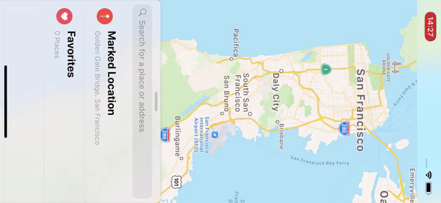

[](https://swift.org/)
[](https://cocoapods.org/pods/FloatingPanel)
[](https://cocoapods.org/pods/FloatingPanel)


# FloatingPanel

FloatingPanel is a simple and easy-to-use UI component designed for a user interface featured in Apple Maps, Shortcuts and Stocks app.
The user interface displays related content and utilities alongside the main content.




## Table of Contents

<details>
<summary>
Click here.
</summary>

- [Table of Contents](#table-of-contents)
- [Features](#features)
- [Requirements](#requirements)
- [Documentation](#documentation)
- [Installation](#installation)
  - [Swift Package Manager](#swift-package-manager)
    - [Using Xcode](#using-xcode)
    - [Using Package.swift](#using-packageswift)
  - [CocoaPods](#cocoapods)
- [Getting Started with SwiftUI](#getting-started-with-swiftui)
  - [Adding a floating panel within a view](#adding-a-floating-panel-within-a-view)
  - [Presenting a floating panel modally within a view](#presenting-a-floating-panel-modally-within-a-view)
  - [Displaying multiple panels](#displaying-multiple-panels)
  - [Next step](#next-step)
- [Getting Started with UIKit](#getting-started-with-uikit)
  - [Adding a floating panel as a child view controller](#adding-a-floating-panel-as-a-child-view-controller)
  - [Presenting a floating panel modally](#presenting-a-floating-panel-modally)
  - [Next step](#next-step-1)
- [Maintainer](#maintainer)
- [License](#license)

</details>

## Features

- Simple container view controller
- Fluid behavior using numeric springing
- Scroll view tracking
- Removal interaction
- Multi panel support
- Modal presentation
- Support for 4 positions (top, left, bottom, right)
- 1 or more magnetic anchors(full, half, tip and more)
- Layout support for all trait environments(i.e. Landscape orientation)
- Common UI elements: surface, backdrop and grabber handle
- Free from common Auto Layout and gesture handling issues
- Compatible with Objective-C
- SwiftUI API support

Examples can be found here:

- [Maps](Examples/Maps) like Apple Maps.app.
- [Maps-SwiftUI](Examples/Maps-SwiftUI) like Apple Maps.app using SwiftUI.
- [Stocks](Examples/Stocks) like Apple Stocks.app.
- [Samples](Examples/Samples)
- [SamplesObjC](Examples/SamplesObjC)
- [SamplesSwiftUI](Examples/SamplesSwiftUI)

## Requirements

FloatingPanel is written in Swift 5.0+ and compatible with iOS 12.0+.

## Documentation

- [API reference on Swift Package Index](https://swiftpackageindex.com/scenee/FloatingPanel/3.0.1/documentation/floatingpanel)
- [FloatingPanel SwiftUI API Guide](/Documentation/FloatingPanel%20SwiftUI%20API%20Guide.md)
- [FloatingPanel API Guide](/Documentation/FloatingPanel%20API%20Guide.md)
- [FloatingPanel 2.0 Migration Guide](/Documentation/FloatingPanel%202.0%20Migration%20Guide.md)

## Installation

### Swift Package Manager

#### Using Xcode

Just follow [this documentation](https://developer.apple.com/documentation/swift_packages/adding_package_dependencies_to_your_app).

#### Using Package.swift

In your Package.swift Swift Package Manager manifest, add the following dependency to your dependencies argument:

```swift
.package(url: "https://github.com/scenee/FloatingPanel", from: "3.0.1"),
```

Add Numerics as a dependency for your target:

```swift
.target(name: "MyTarget", dependencies: [
  .product(name: "FloatingPanel", package: "FloatingPanel"),
  "AnotherModule"
]),
```

And then add `import FloatingPanel` in your source code.

### CocoaPods

FloatingPanel is available through [CocoaPods](https://cocoapods.org). To install
it, simply add the following line to your Podfile:

```ruby
pod 'FloatingPanel'
```

## Getting Started with SwiftUI

### Adding a floating panel within a view

```swift
@State private var layout = MyFloatingPanelLayout()
@State private var state: FloatingPanelState?

var view: some View {
  MainView()
      .floatingPanel { proxy in
          ScrollView {
              VStack(spacing: 20) {
                  ForEach(items) { item in
                      ItemRow(item)
                  }
              }
              .padding()
          }
          .floatingPanelScrollTracking(proxy: proxy)
      }
      .floatingPanelState($state)
      .floatingPanelLayout(layout)
      .floatingPanelBehavior(MyCustomBehavior())
      .floatingPanelSurfaceAppearance(.transparent)
}
```

### Presenting a floating panel modally within a view

Please define a custom coordinator object to present a floating panel as a modality.

```swift
struct HomeView: View {
  var view: some View {
    MainView()
        .floatingPanel(
          coordinator: MyPanelCoordinator.self
        ) { proxy in
          ...
        }
  }
}

class MyPanelCoordinator: FloatingPanelCoordinator {
    ...
    func setupFloatingPanel<Main, Content>(
        mainHostingController: UIHostingController<Main>,
        contentHostingController: UIHostingController<Content>
    ) where Main: View, Content: View {
        // Set the delegate object
        controller.delegate = delegate

        // Set up the content
        contentHostingController.view.backgroundColor = .clear
        controller.set(contentViewController: contentHostingController)

        /* =============== HERE ==================== */
        // NOTE: 
        // Present the floating panel on the next run loop cycle
        // to ensure proper view hierarchy setup.
        Task { @MainActor in
            mainHostingController.present(controller, animated: false)
        }
    }
    ...
}
```

### Displaying multiple panels
  
Multiple floating panels can be displayed in the same view hierarchy. To customize the layout and behavior for each Floating Panel individually, place modifiers directly below each panel.

```swift
Color.orange
    .ignoresSafeArea()
    .floatingPanel(
        coordinator: MyPanelCoordinator.self
    ) { proxy in
        ContentView(proxy: proxy)
    }
    .floatingPanelSurfaceAppearance(.transparent())
    .floatingPanel(
        coordinator: MyPanelCoordinator.self
    ) { proxy in
        ContentView(proxy: proxy)
    }
    .floatingPanelSurfaceAppearance(.transparent(cornerRadius: 24))
```

### Next step

For more details, see the [FloatingPanel SwiftUI API Guide](/Documentation/FloatingPanel%20SwiftUI%20API%20Guide.md)

## Getting Started with UIKit

### Adding a floating panel as a child view controller

```swift
import UIKit
import FloatingPanel

class ViewController: UIViewController, FloatingPanelControllerDelegate {
    var fpc: FloatingPanelController!

    override func viewDidLoad() {
        super.viewDidLoad()
        // Initialize a `FloatingPanelController` object.
        fpc = FloatingPanelController()

        // Assign self as the delegate of the controller.
        fpc.delegate = self // Optional

        // Set a content view controller.
        let contentVC = ContentViewController()
        fpc.set(contentViewController: contentVC)

        // Track a scroll view(or the siblings) in the content view controller.
        fpc.track(scrollView: contentVC.tableView)

        // Add and show the views managed by the `FloatingPanelController` object to self.view.
        fpc.addPanel(toParent: self)
    }
}
```

### Presenting a floating panel modally

```swift
let fpc = FloatingPanelController()
let contentVC = ...
fpc.set(contentViewController: contentVC)

fpc.isRemovalInteractionEnabled = true // Optional: Let it removable by a swipe-down

self.present(fpc, animated: true, completion: nil)
```

You can show a floating panel over UINavigationController from the container view controllers as a modality of `.overCurrentContext` style.

> [!NOTE]
> FloatingPanelController has the custom presentation controller. If you would like to customize the presentation/dismissal, please see [Transitioning](Sources/Transitioning.swift).

### Next step

For more details, see the [FloatingPanel API Guide](/Documentation/FloatingPanel%20API%20Guide.md).

## Maintainer

Shin Yamamoto <shin@scenee.com> | [@scenee](https://twitter.com/scenee)

## License

FloatingPanel is available under the MIT license. See the LICENSE file for more info.
